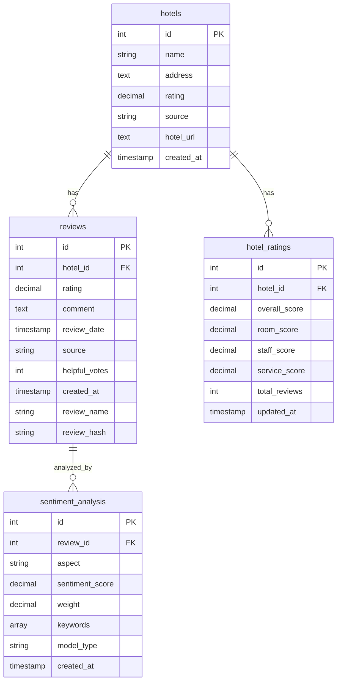

# AccomRater - Hệ thống đánh giá dịch vụ lưu trú thông minh

Hệ thống hỗ trợ đánh giá chất lượng dịch vụ lưu trú dựa trên phương pháp khai thác ý kiến khách hàng đánh giá trực tuyến, sử dụng Graph Neural Networks (GNN).

## 📑 Mục lục

- [Chức năng chính](#chức-năng-chính)
- [Yêu cầu hệ thống](#yêu-cầu-hệ-thống)
- [Cài đặt với Docker](#cài-đặt-với-docker)
  - [Clone repository](#-clone-repository)
  - [Cấu hình môi trường](#️-cấu-hình-môi-trường)
  - [Khởi chạy container](#-khởi-chạy-container)
  - [Theo dõi quá trình](#-theo-dõi-quá-trình)
  - [Dừng hệ thống](#-dừng-hệ-thống)
- [Luồng hoạt động của Booking Crawler](#luồng-hoạt-động-của-booking-crawler)
- [Database Setup](#database-setup)
- [Cài đặt thủ công](#cài-đặt-thủ-công-không-dùng-docker)
- [Cấu trúc project](#cấu-trúc-project)
- [Các giai đoạn phát triển](#các-giai-đoạn-phát-triển)
- [Troubleshooting](#troubleshooting)
- [License](#license)
- [Tác giả](#tác-giả)

## Chức năng chính

- Thu thập đánh giá từ Booking.com và Agoda.com
- Phân tích sentiment từ bình luận khách hàng
- Đánh giá chất lượng dịch vụ dựa trên GNN
- Gợi ý dịch vụ phù hợp cho khách hàng

## Yêu cầu hệ thống

- Docker & Docker Compose
- Python 3.8+
- PyTorch 
- TensorFlow 2.0+
- Streamlit
- BeautifulSoup4
- Selenium
- NetworkX

## Cài đặt với Docker

### 📥 Clone repository

```bash
git clone https://github.com/saitamacode196/accomrater.git
cd accomrater
```

### ⚙️ Cấu hình môi trường

1. Tạo file `.env` hoặc sử dụng file `.env.docker` có sẵn:

```bash
cp .env.docker .env
```

2. Tùy chỉnh các biến môi trường trong file `.env` nếu cần:

```
# 💾 Database config
DB_NAME=accom_rater
DB_USER=postgres
DB_PASSWORD=your_password
DB_HOST=postgres
DB_PORT=5432

# 🕸️ Crawler config
HEADLESS_MODE=true
CRAWL_DELAY=3
MAX_HOTELS=5
```

### 🚀 Khởi chạy container

Có hai cách để chạy hệ thống:

#### Cách 1: Chạy toàn bộ hệ thống

```bash
docker-compose up -d
```

Lệnh này sẽ khởi chạy:
- PostgreSQL database
- Selenium Hub và Chrome node
- Crawler app

#### Cách 2: Chạy từng thành phần riêng biệt

1. Khởi chạy database:

```bash
docker-compose up -d postgres
```

2. Khởi chạy Selenium Hub và Chrome node:

```bash
docker-compose up -d selenium-hub chrome
```

3. Khởi chạy crawler:

```bash
docker-compose up crawler
```

### 📊 Theo dõi quá trình

Bạn có thể theo dõi log của crawler:

```bash
docker-compose logs -f crawler
```

Kiểm tra trạng thái các container:

```bash
docker-compose ps
```

### 🛑 Dừng hệ thống

Dừng và giữ lại dữ liệu:

```bash
docker-compose down
```

Dừng và xóa tất cả dữ liệu:

```bash
docker-compose down -v
```

## Luồng hoạt động của Booking Crawler

Crawler sẽ thực hiện các bước sau:

1. Cấu hình logging và tạo thư mục logs
2. Chờ database khởi động hoàn toàn (5 giây)
3. Load biến môi trường từ file `.env`
4. Khởi tạo BookingCrawler
5. Lấy danh sách khách sạn từ Booking.com
6. Giới hạn số lượng khách sạn theo biến `MAX_HOTELS`
7. Với mỗi khách sạn:
   - Lấy thông tin chi tiết và đánh giá
   - Lưu thông tin khách sạn vào database
   - Lưu các đánh giá vào database
   - Chờ một khoảng thời gian trước khi xử lý khách sạn tiếp theo

## Database Setup

### Entity Relationship Diagram


## Cài đặt thủ công (không dùng Docker)

1. Tạo môi trường ảo:
```bash 
conda create -n accomrater python=3.8
conda activate accomrater
```

2. Cài đặt dependencies:
```bash
pip install -r requirements.txt
```

3. Chuẩn bị database PostgreSQL và cập nhật file `.env`

4. Chạy ứng dụng:
```bash
streamlit run app.py
```

## Cấu trúc project
```
project/
├── app.py                # Main Streamlit app
├── components/          
│   ├── header.py        # Header component 
│   ├── crawler.py       # Crawl data component
│   ├── hotel_list.py    # Hotel listing component
│   └── analysis.py      # Analysis component
├── models/
│   ├── gnn_model.py     # GNN model
│   └── bert_model.py    # BERT model  
├── utils/
│   ├── crawler_utils.py # Common crawler utilities
│   └── db_utils.py      # Database operations
└── requirements.txt
```

## Troubleshooting

### Vấn đề với Chrome WebDriver

Nếu gặp lỗi với ChromeDriver, hãy kiểm tra:
- Phiên bản Chrome trong container đã tương thích với ChromeDriver
- Kiểm tra logs của container selenium-hub và chrome

```bash
docker-compose logs selenium-hub
docker-compose logs chrome
```

### Vấn đề với Database

Nếu crawler không thể kết nối đến database:
- Kiểm tra cấu hình trong file `.env`
- Đảm bảo container postgres đã chạy và khởi tạo thành công

```bash
docker-compose logs postgres
```

### Restart Crawler

Để chạy lại crawler sau khi cấu hình:

```bash
docker-compose restart crawler
```

## Các giai đoạn phát triển

Dự án AccomRater được phát triển qua 3 giai đoạn chính:

### Giai đoạn 1: Thu thập dữ liệu

Thu thập dữ liệu từ các trang web đánh giá khách sạn lớn:

- **Booking.com Crawler**: Thu thập tự động thông tin khách sạn và đánh giá
- **Agoda.com Crawler**: Thu thập tự động thông tin khách sạn và đánh giá

Dữ liệu thu thập bao gồm:
- Thông tin cơ bản về khách sạn (tên, địa chỉ, đánh giá, URL)
- Đánh giá của khách hàng (điểm số, nội dung, ngày đánh giá)

📚 **Tham khảo thêm**:
- [Web Crawling với Selenium và BeautifulSoup](https://www.scrapingbee.com/blog/selenium-python/)
- [Hướng dẫn Selenium với Python](https://selenium-python.readthedocs.io/)
- [BeautifulSoup Documentation](https://www.crummy.com/software/BeautifulSoup/bs4/doc/)

### Giai đoạn 2: Xây dựng và phát triển mô hình GNN

Xây dựng các mô hình Graph Neural Networks (GNN) để phân tích sentiment và đánh giá chất lượng dịch vụ:

- **GCN (Graph Convolutional Networks)**: Mô hình GNN cơ bản dựa trên tích chập đồ thị
- **GAT (Graph Attention Networks)**: Mô hình GNN nâng cao sử dụng cơ chế attention

Quá trình phát triển mô hình bao gồm:
- Tiền xử lý dữ liệu và xây dựng đồ thị
- Thiết kế và huấn luyện mô hình
- Đánh giá hiệu suất và so sánh giữa các mô hình

📚 **Tham khảo thêm**:
- [PyTorch Geometric Documentation](https://pytorch-geometric.readthedocs.io/en/latest/)
- [GCN - Paper gốc](https://arxiv.org/abs/1609.02907) (Semi-Supervised Classification with Graph Convolutional Networks)
- [GAT - Paper gốc](https://arxiv.org/abs/1710.10903) (Graph Attention Networks)
- [DGL - Deep Graph Library](https://www.dgl.ai/): Thư viện xây dựng và huấn luyện GNN

### Giai đoạn 3: Xây dựng UI Demo

Phát triển giao diện người dùng trực quan để demo các chức năng của hệ thống:

- **Streamlit UI**: Xây dựng giao diện tương tác với Streamlit
- **Trực quan hóa đồ thị**: Hiển thị kết quả phân tích dưới dạng đồ thị
- **Tích hợp mô hình**: Tích hợp các mô hình GNN đã huấn luyện vào giao diện

📚 **Tham khảo thêm**:
- [Streamlit Documentation](https://docs.streamlit.io/)
- [Plotly cho visualization](https://plotly.com/python/)
- [NetworkX cho visualization đồ thị](https://networkx.org/documentation/stable/tutorial.html)

## VS Code Container Debug
```json

{
    "version": "0.2.0",
    "configurations": [
        {
            "name": "Python: Booking Crawler Remote",
            "type": "python",
            "request": "attach",
            "port": 5678,
            "host": "localhost",
            "pathMappings": [
                {
                    "localRoot": "${workspaceFolder}",
                    "remoteRoot": "/app"
                }
            ]
        }
    ]
}
```
## License
MIT

## Tác giả
PHẠM LÊ TÂN