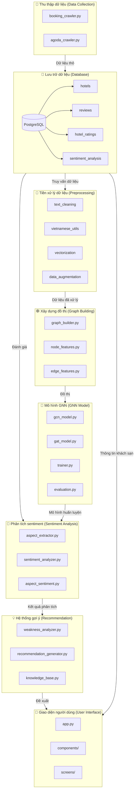

# 📊 Sơ đồ quy trình dự án AccomRater 🔄



## 🔄 Luồng hoạt động
1. **Thu thập dữ liệu**:
   - Crawlers thu thập thông tin từ Booking.com và Agoda.com
   - Xử lý phân trang, lazy loading, đánh giá tiếng Việt

2. **Lưu trữ dữ liệu**:
   - PostgreSQL database lưu thông tin khách sạn và đánh giá
   - Hệ thống hash để tránh trùng lặp dữ liệu

3. **Tiền xử lý dữ liệu**:
   - Làm sạch văn bản (HTML, emoji, URL)
   - Xử lý tiếng Việt (tách từ, sửa lỗi chính tả, xử lý teencode)
   - Vectorization (TF-IDF, Word2Vec, PhoBERT)

4. **Xây dựng đồ thị**:
   - Tạo nodes: khách sạn, người dùng, đánh giá, khía cạnh dịch vụ
   - Xây dựng edges thể hiện mối quan hệ
   - Trích xuất đặc trưng cho nodes và edges

5. **Mô hình GNN**:
   - Triển khai GCN và GAT
   - Huấn luyện với batch gradient descent
   - Đánh giá hiệu năng với cross-validation

6. **Phân tích sentiment**:
   - Trích xuất khía cạnh từ đánh giá
   - Phân tích sentiment cho từng khía cạnh
   - Tổng hợp điểm sentiment theo nhiều tiêu chí

7. **Hệ thống gợi ý**:
   - Xác định điểm yếu dựa trên so sánh với benchmark
   - Phân tích tần suất từ khóa tiêu cực
   - Đề xuất cải thiện dựa trên knowledge base

8. **Giao diện người dùng**:
   - Dashboard Streamlit hiển thị phân tích
   - Tương tác và filter theo nhu cầu
   - Đề xuất cải thiện cụ thể cho chủ khách sạn

## 🔄 Triển khai

```
📂 AccomRater/
├── 📄 app.py                         # Ứng dụng Streamlit chính
├── 📂 crawlers/                      # Thu thập dữ liệu
│   ├── 📄 booking_crawler.py
│   └── 📄 agoda_crawler.py
├── 📂 data_preprocessing/            # Xử lý dữ liệu
│   ├── 📂 text_cleaning/
│   ├── 📂 vietnamese_utils/
│   └── 📂 vectorization/
├── 📂 model_training/                # Huấn luyện mô hình
│   ├── 📂 graph/
│   └── 📂 sentiment/
├── 📂 recommendation/                # Hệ thống gợi ý
│   ├── 📄 weakness_analyzer.py
│   └── 📄 recommendation_generator.py
└── 📂 ui/                            # Giao diện người dùng
    └── 📂 components/
```

📍 Triển khai: Docker + Docker Compose
🔄 Trạng thái: Hoàn thành v1.0.0